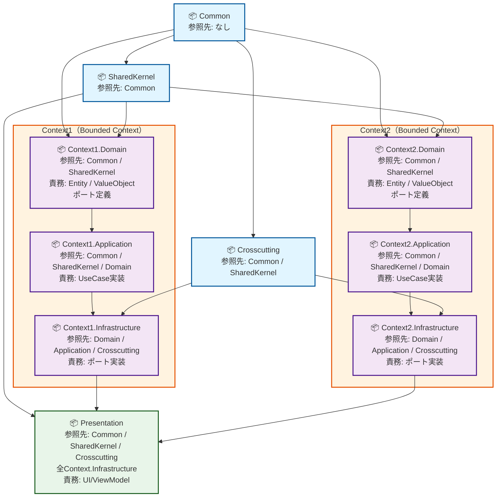

# AGENTS.md – SupportAdvance プロジェクト共通AI指示書（ルート）

## 0. 本書の位置づけ

本書は、SupportAdvance プロジェクトにおける **統合支援AI（GitHub Copilot）に対する最上位の指示書**である。

- 本書は AI（GitHub Copilot）により常に自動で読み込まれる前提で記述される
- 工程・文書種別ごとの詳細ルールは、各ディレクトリ配下の `.agent.md` を追加しルールを適用する
- 本書は 短く、変更頻度の低い原則のみを定義する
- **本書内の「AI」はすべて GitHub Copilot を指す**
- **AI は設計・仕様、実装、品質評価のすべての領域で支援を提供する**

## 1. プロジェクト概要

- システム名称: SupportAdvance
- 対象: 製造業向け基幹システム
- 開発言語: C#
- プラットフォーム: .NET 10.0
- プレゼンテーション層: WPF（MVVM Toolkit）を主とする
- アーキテクチャ: クリーンアーキテクチャ

AI は、本プロジェクトを 長期運用・段階的拡張・将来引き継ぎを前提とした業務基幹システムとして扱うこと。

## 2. 大原則（必ず守ること）

### 2.1 判断責任

- すべての判断責任は人にある
- AI は結論を断定しない
- AI の出力は「提案・整理結果・指摘」に限定される

### 2.2 推測禁止

- 指示されていない仕様・設計・前提を 推測で補完しない
- 不明点・未確定事項は明示的に「未確定」と記載する

### 2.3 実装禁止（人の承認前）

- AI は 人の承認がない状態で勝手に変更を確定しない
- 変更は設計確定後、人の判断を経ての上で確定する

## 3. クリーンアーキテクチャに関する基本理解

### 3.1 構成層（レイヤ）

SupportAdvance のクリーンアーキテクチャ構成層は以下とする。

- プレゼンテーション層（UI / View / ViewModel）
- アプリケーション層（UseCase / DTO / 業務フロー調整）
- ドメイン層（Entity / ValueObject / 業務ルール）
- インフラストラクチャ層（DB / 外部API / 技術実装）

依存関係は 必ず外側→内側へ向かうこと。

### 3.2 Common , Crosscutting , SharedKernel の扱い

#### Common

- Common は クリーンアーキテクチャの構成層ではない
- 全層から参照され得る 純粋・副作用なしの共有要素とする
- 値オブジェクト、Result型、純粋計算、技術非依存の抽象のみを含む

#### Crosscutting

- Crosscutting は クリーンアーキテクチャの構成層ではない
- ログ、トランザクション、例外マッピング等の 横断的関心事である
- Domain / Application 層は Crosscutting を参照してはならない
- Pipeline / Middleware / Decorator として外側で機能させる

#### SharedKernel

- SharedKernel は クリーンアーキテクチャの構成層ではない 
- 複数のBounded Context が共有するドメインモデルのサブセットである

**定義**
- 異なるBounded Context間で、ドメイン的に一致する概念を統一的に表現するためのドメインモデル
- 例：顧客ID、注文ID、商品ID などの共通の ValueObject や Enum

**SharedKernel に含まれるもの**
- ValueObject（顧客識別子、金額、日時範囲など）
- Enum（ステータス、種別など、ドメイン的に共通の分類）
- 共通ドメインイベント（顧客登録完了、注文確定など）
- 共通のドメインルール（例：価格は必ず非負でなければならない）

**SharedKernel に含まれないもの**
- 各Bounded Contextに固有のEntity、Aggregate
- Infrastructure実装（Repository、ORM、データベースアクセス）
- Application層のロジック（UseCase、DTO変換など）
- UI関連のコード

**版管理と更新に関する注意**
- SharedKernel の変更は複数のBounded Contextに影響する
- SharedKernel を変更した場合、すべての参照Contextで互換性確認が必須
- 可能な限り破壊的変更を避け、後方互換性を保つこと
- SharedKernel の変更は設計レビューを経ること

### 3.3 層間の依存関係ルール

#### 3.3.1 各層が参照可能な範囲

**プレゼンテーション層が参照可能なもの**
- アプリケーション層（UseCase / DTO）
- Common
- 自身のレイヤ内モジュール

**アプリケーション層が参照可能なもの**
- ドメイン層（Entity / ValueObject / DomainService）
- Common
- SharedKernel
- インフラストラクチャ層（インターフェース経由のみ、実装には依存しない）
- 自身のレイヤ内モジュール

**ドメイン層が参照可能なもの**
- Common
- SharedKernel
- 自身のレイヤ内モジュール

**インフラストラクチャ層が参照可能なもの**
- 全層のインターフェース・抽象（実装ではない）
- Common
- SharedKernel
- 自身のレイヤ内モジュール
- 外部ライブラリ / DB / API

#### 3.3.2 層間の参照禁止（必須）

- **ドメイン層は以下を一切参照してはならない**
  - プレゼンテーション層
  - アプリケーション層
  - インフラストラクチャ層（具象実装）

- **アプリケーション層は以下を参照してはならない**
  - プレゼンテーション層
  - インフラストラクチャ層（具象実装、インターフェースは可）

- **インフラストラクチャ層は以下の具象実装を参照してはならない**
  - 他のインフラストラクチャ層の実装クラス
  - アプリケーション層・ドメイン層の実装クラス（インターフェース・抽象は可）

#### 3.3.3 依存性逆転の原則（DIP）

- 上位層（外側）は下位層（内側）の **具象クラスに依存しない**
- **必ずインターフェース / 抽象基底クラスを経由する**
  

例：
```csharp
// ❌ NG：具象実装に直接依存
public class OrderUseCase {
    private readonly SqlServerOrderRepository _repository; // 具象クラス
}

// ✅ OK：インターフェースを経由
public class OrderUseCase {
    private readonly IOrderRepository _repository; // インターフェース
}
```

- **インターフェース（ポート）の定義位置**
  - インターフェースは、**それを必要とする最も内側の層に定義する**
  - 実装（アダプター）は、**より下位のレイヤに配置する**
  - **特に Repository インターフェースは Domain層に定義する**（ポートの原則）

例：
```
Domain層: IOrderRepository（インターフェース定義 / ポート）
Infrastructure層: SqlServerOrderRepository（実装 / アダプター）
```

```
Presentation層: IOrderPresenter（インターフェース定義 / ポート）
Presentation層: OrderPresenter（実装 / アダプター）
```

#### 3.3.4 依存性注入（DI）の原則

- DI コンテナへの登録は **Infrastructure層のみが責務**
- プレゼンテーション層は起動時に DI コンテナを構成する
- ドメイン層・アプリケーション層は DI フレームワークに依存しない
- コンストラクタインジェクション（CI）を原則とする
- サービスロケータパターンは禁止

#### 3.3.5 循環依存の禁止

- 層間、モジュール間で循環依存が発生する設計は不可
- 循環依存が生じた場合は、責務の分割・再設計で解決する

#### 3.3.6 UseCase の入出力ポート原則

- **UseCase は外部との通信を入出力ポート（インターフェース）で定義する**
- UseCase の入力ポート
  - Request DTO：外部からの入力を表現
  - UseCase インターフェース（Interactor）：実行可能な操作を定義
- UseCase の出力ポート
  - Response DTO：戻り値の構造を定義
  - Repository インターフェース（Domain層で定義）：永続化層へのアクセスポイント
  - Presenter インターフェース：プレゼンテーション層への結果返却ポイント

例：
```csharp
// Domain層：Repository ポート定義
public interface IOrderRepository {
    void Save(Order order);
    Order GetById(string id);
}

// Application層：UseCase ポート定義
public interface ICreateOrderUseCase {
    void Execute(CreateOrderRequest request);
}

// Application層：Presenter ポート定義
public interface IOrderPresenter {
    void Present(CreateOrderResponse response);
}

// Application層：UseCase実装
public class CreateOrderInteractor : ICreateOrderUseCase {
    private readonly IOrderRepository _repository;  // Domain層のポート
    private readonly IOrderPresenter _presenter;
    
    public void Execute(CreateOrderRequest request) {
        // ドメインロジック実行
        var order = new Order(/* ... */);
        
        // Domain層のRepository経由で永続化
        _repository.Save(order);
        
        // Presenter経由で結果を返却
        _presenter.Present(new CreateOrderResponse { /* ... */ });
    }
}
```

- UseCase は **ドメインモデルを操作**し、**DTO で入出力を行う**
- DTO は Response DTO を通じて Presenter に結果を渡す
- Presenter は DTO を ViewModel へ変換（プレゼンテーション層が実装）

#### 3.3.7 Presenter パターン

- **Presenter はプレゼンテーション層へのアウトプットポート**
- Presenter インターフェースは Application層に定義
- Presenter 実装は Presentation層に配置
- UseCase から Presenter に DTO を渡す
- Presenter は DTO を ViewModel に変換し、View に渡す

例：
```csharp
// Application層：Presenterインターフェース定義
public interface IOrderPresenter {
    void Present(CreateOrderResponse response);
}

// Presentation層：Presenter実装
public class OrderPresenter : IOrderPresenter {
    public void Present(CreateOrderResponse response) {
        var viewModel = new OrderViewModel {
            OrderId = response.OrderId,
            Status = response.Status
        };
        // ViewModelをViewに渡す
    }
}
```

- **重要**：UseCase は Presenter を通じてのみ View へ情報を返す
- UseCase が直接 View を参照することは禁止

## 4. 依存性注入（DI）の体系

### 4.1 DI の基本原則

**2つの概念を区別する：**

1. **DI コンテナでの登録・解決**（❌ 限定的に実施）
   - サービスの生成・ライフタイム管理をコンテナで一元化
   - DI フレームワーク（Autofac, Microsoft.Extensions.DependencyInjection等）の設定

2. **依存性注入（受け取る側）**（✅ すべての層で可）
   - 依存を外から受け取る設計
   - コンストラクタインジェクション（CI）による受け取り

### 4.2 各層における DI の責務

| 層 | DI コンテナ登録 | 依存を受け取る | 例 |
|---|---|---|---|
| **Presentation層** | ✅ 起動時に全体構成 | ✅ | ViewModel / View は DI で受け取る |
| **Application層** | ❌ | ✅ | UseCase はコンストラクタで Repository / DomainService を受け取る |
| **Domain層** | ❌ | ✅ | Entity は IClock, IDomainService 等を受け取る |
| **Infrastructure層** | ✅ 具象実装の登録 | ✅ | Repository は外部ライブラリ等を受け取る |

### 4.3 各層での実装方針

#### 4.3.1 Presentation層

- **責務**：DI コンテナの全体構成と起動
- **実装**：起動時（Main / App.xaml.cs など）で全層のサービス登録を行う
- **例**：
```csharp
// Presentation層（起動時）
var services = new ServiceCollection();

// Domain層の依存
services.AddSingleton<IClock, SystemClock>();

// Application層の依存
services.AddScoped<IOrderUseCase, CreateOrderInteractor>();
services.AddScoped<IOrderPresenter, OrderPresenter>();

// Infrastructure層の依存
services.AddScoped<IOrderRepository, SqlServerOrderRepository>();

var provider = services.BuildServiceProvider();
var viewModel = provider.GetRequiredService<OrderViewModel>();
```

#### 4.3.2 Application層

- **責務**：受け取った依存を ドメイン層とインフラストラクチャ層で活用
- **禁止**：DI フレームワークの直接利用
- **例**：
```csharp
// Application層：DI フレームワークに依存しない
public class CreateOrderInteractor : ICreateOrderUseCase {
    private readonly IOrderRepository _repository;
    private readonly IOrderPresenter _presenter;
    private readonly ICreateOrderDomainService _domainService;
    
    // コンストラクタで依存を受け取る
    public CreateOrderInteractor(
        IOrderRepository repository, 
        IOrderPresenter presenter,
        ICreateOrderDomainService domainService) {
        _repository = repository;
        _presenter = presenter;
        _domainService = domainService;
    }
    
    public void Execute(CreateOrderRequest request) {
        // ドメインサービス経由でドメインロジック実行
        var result = _domainService.CreateOrder(/* ... */);
        
        // Repository を使用して永続化
        _repository.Save(result);
        
        // Presenter を通じて結果返却
        _presenter.Present(new CreateOrderResponse { /* ... */ });
    }
}
```

#### 4.3.3 Domain層

- **責務**：受け取った依存を ビジネスロジック内で活用
- **禁止**：DI フレームワークの直接利用
- **例**：
```csharp
// Domain層：DI フレームワークに依存しない
public class Order : AggregateRoot {
    private readonly IClock _clock;
    
    // コンストラクタで依存を受け取る
    public Order(string id, IClock clock) {
        Id = id;
        _clock = clock;
    }
    
    public void Complete() {
        // 受け取った IClock を使用
        this.CompletedAt = _clock.Now();
    }
}

// Domain層のサービス
public class CreateOrderDomainService : ICreateOrderDomainService {
    private readonly IClock _clock;
    
    public CreateOrderDomainService(IClock clock) {
        _clock = clock;
    }
    
    public Order CreateOrder(string customerId, List<OrderItem> items) {
        var order = new Order(Guid.NewGuid().ToString(), _clock);
        // ドメインロジック...
        return order;
    }
}
```

#### 4.3.4 Infrastructure層

- **責務**：DI コンテナへの具象実装の登録と、外部依存の受け取り
- **実装**：外部ライブラリ等を DI で受け取り、リポジトリ等を実装
- **例**：
```csharp
// Infrastructure層：リポジトリ実装
public class SqlServerOrderRepository : IOrderRepository {
    private readonly IDbConnection _connection;
    private readonly ILogger<SqlServerOrderRepository> _logger;
    
    public SqlServerOrderRepository(
        IDbConnection connection, 
        ILogger<SqlServerOrderRepository> logger) {
        _connection = connection;
        _logger = logger;
    }
    
    public void Save(Order order) {
        // 具象実装...
    }
}
```

### 4.4 禁止パターン

- **❌ サービスロケータパターン**
```csharp
// 禁止：サービスロケータを直接使用
public class OrderService {
    private readonly IServiceProvider _serviceProvider;
    
    public void Execute() {
        var repository = _serviceProvider.GetService<IOrderRepository>(); // ❌
    }
}
```

- **❌ Static コンテナアクセス**
```csharp
// 禁止：静的なコンテナへのアクセス
public class OrderService {
    public void Execute() {
        var repository = ServiceLocator.GetService<IOrderRepository>(); // ❌
    }
}
```

- **❌ Domain層での new による明示的インスタンス化**
```csharp
// 禁止：Domain層で具象クラスを生成
public class OrderAggregateRoot {
    private readonly IRepository _repository = new SqlServerRepository(); // ❌
}
```

### 4.5 ライフタイム管理

- **Singleton**：アプリケーション全体で同一インスタンス
  - 用途：ステートレスなサービス（IClock, ILogger ファクトリなど）
  
- **Scoped**：リクエスト / トランザクション単位で同一インスタンス
  - 用途：UseCase, Repository（DB コネクション単位）

- **Transient**：毎回新しいインスタンスを生成
  - 用途：ステートフルなオブジェクト（DTO, ViewModel等）

## 5. マルチコンテキスト構成でのプロジェクト依存関係

### 5.1 プロジェクト構成と依存関係の原則

SupportAdvance は **Presentation層が全体共通**で、各 **Bounded Context が Domain / Application / Infrastructure** のみを持つ構成である。

**各フォルダは対応する .csproj ファイルを含む（例：CarPreferences.Domain/ → CarPreferences.Domain.csproj）**

```
src/
├── Common/
├── SharedKernel/
├── Crosscutting/
├── Presentation/
└── Contexts/
    └── Samples/
        ├── CarPreferences.Domain/
        ├── CarPreferences.Application/
        ├── CarPreferences.Infrastructure/
        └── Directory.Build.props
```

### 5.1.0 テストプロジェクト構成（tests/ フォルダ）

テストプロジェクトは src/ と同じ階層構造を保持する。

```
tests/
├── Common.Tests/                                （Common層のテスト）
├── Crosscutting.Tests/                          （Crosscutting層のテスト）
├── SharedKernel.Tests/                          （SharedKernel層のテスト）
└── Contexts/
    └── Samples/
        ├── CarPreferences.Domain.Tests/         （Domain層のテスト）
        ├── CarPreferences.Application.Tests/    （Application層のテスト）
        ├── CarPreferences.Infrastructure.Tests/ （Infrastructure層のテスト）
        └── Directory.Build.props
```

**テストプロジェクトの参照原則：**
- Domain.Tests → Common / SharedKernel / Domain
- Application.Tests → Common / SharedKernel / Domain / Application
- Infrastructure.Tests → Common / SharedKernel / Domain / Application / Infrastructure / Crosscutting

### 5.1.1 依存関係ダイアグラム（全体像）



**ルール：**
- ✅ **左から右への依存のみ許可**（内側→外側）
- ❌ **右から左への参照は禁止**（循環依存防止）
- ❌ **Context間での直接参照は禁止**

### 5.1.2 プロジェクト参照チェックリスト

以下の形式で各プロジェクトの参照を整理：

**◎ = 参照OK　× = 参照禁止**

| → | Common | SharedKernel | Crosscutting | Context.D | Context.A | Context.I | Other.I | Pres |
|---|---|---|---|---|---|---|---|---|
| **Common** | - | × | × | × | × | × | × | × |
| **SharedKernel** | ◎ | - | × | × | × | × | × | × |
| **Crosscutting** | ◎ | ◎ | - | × | × | × | × | × |
| **Context.D** | ◎ | ◎ | × | - | × | × | × | × |
| **Context.A** | ◎ | ◎ | × | ◎ | - | × | × | × |
| **Context.I** | ◎ | ◎ | ◎ | ◎ | ◎ | - | × | × |
| **Other.I** | ◎ | ◎ | ◎ | × | × | × | - | × |
| **Presentation** | ◎ | ◎ | ◎ | × | × | ◎ | ◎ | - |

**凡例：**
- ◎ = 参照可能
- × = 参照禁止
- Context.D = 当該Context内のDomain層（他Context.Dは参照禁止）
- Context.A = 当該Context内のApplication層
- Context.I = 当該Context内のInfrastructure層
- Other.I = 他のContext.Infrastructure層

### 5.1.3 参照関係の詳細表

```
Common
└─ 参照先: なし

SharedKernel
└─ 参照先: Common

Crosscutting
├─ 参照先: Common
└─ 参照先: SharedKernel

Context.Domain（各 Bounded Context）
├─ 参照先: Common
├─ 参照先: SharedKernel
└─ **責務: ポート（Repository等）の定義**

Context.Application（各 Bounded Context）
├─ 参照先: Common
├─ 参照先: SharedKernel
├─ 参照先: Context.Domain（同一のみ）
└─ **責務: UseCase実装、ポート使用**

Context.Infrastructure（各 Bounded Context）
├─ 参照先: Common
├─ 参照先: SharedKernel
├─ 参照先: Context.Domain（同一のみ）
├─ 参照先: Context.Application（同一のみ）
├─ 参照先: Crosscutting
└─ **責務: ポート実装、技術実装**

Presentation（全体共通）
├─ 参照先: Common
├─ 参照先: SharedKernel
├─ 参照先: Crosscutting
├─ 参照先: Context1.Infrastructure
├─ 参照先: Context2.Infrastructure
├─ 参照先: Context3.Infrastructure（必要に応じて）
└─ **責務: DI構成、UI/ViewModel**
```

### 5.2 各プロジェクトの参照関係（.csproj の参照設定）


#### Common プロジェクト

**参照先：なし**
```xml
<!-- 他に依存しない -->
```

#### SharedKernel プロジェクト

**参照先：Common のみ**
```xml
<ItemGroup>
  <ProjectReference Include="..\..\Common\Common.csproj" />
</ItemGroup>
```

#### Crosscutting プロジェクト

**参照先：Common / SharedKernel**
```xml
<ItemGroup>
  <ProjectReference Include="..\..\Common\Common.csproj" />
  <ProjectReference Include="..\..\SharedKernel\SharedKernel.csproj" />
</ItemGroup>
```

#### Context.Domain プロジェクト（各 Bounded Context）

**責務：** 
- ドメインエンティティ・ValueObject・ドメインサービスの実装
- **Repository インターフェース（ポート）の定義**

**参照先：Common / SharedKernel のみ**
```xml
<!-- 例：Contexts/Samples/CarPreferences.Domain/CarPreferences.Domain.csproj -->
<ItemGroup>
  <ProjectReference Include="..\..\Common\Common.csproj" />
  <ProjectReference Include="..\..\SharedKernel\SharedKernel.csproj" />
</ItemGroup>
```

**例：Domain層で Repository インターフェースを定義**
```csharp
// Domain/Repositories/IOrderRepository.cs
namespace SampleContext.Domain.Repositories {
    public interface IOrderRepository {
        void Save(Order order);
        Order GetById(OrderId id);
    }
}
```

**禁止事項：**
- ❌ Application, Infrastructure への参照
- ❌ 他の Context への参照
- ❌ Presentation への参照

#### Context.Application プロジェクト（各 Bounded Context）

**責務：**
- UseCase（Interactor）の実装
- DTO の定義
- Domain層のポート（インターフェース）を DI で受け取る

**参照先：Common / SharedKernel / 同一Context内の Domain のみ**
```xml
<!-- 例：Contexts/Samples/CarPreferences.Application/CarPreferences.Application.csproj -->
<ItemGroup>
  <ProjectReference Include="..\..\Common\Common.csproj" />
  <ProjectReference Include="..\..\SharedKernel\SharedKernel.csproj" />
  <ProjectReference Include="..\CarPreferences.Domain\CarPreferences.Domain.csproj" />
</ItemGroup>
```

**例：Application層で Domain のポートを使用**
```csharp
// Application/UseCases/CreateOrderInteractor.cs
using SampleContext.Domain.Repositories; // Domain層のポート

namespace SampleContext.Application.UseCases {
    public class CreateOrderInteractor {
        private readonly IOrderRepository _repository; // Domain層で定義
        
        public CreateOrderInteractor(IOrderRepository repository) {
            _repository = repository;
        }
    }
}
```

**禁止事項：**
- ❌ Infrastructure への直接参照（具象実装は参照不可）
- ❌ 他の Context への参照
- ❌ Presentation への参照

#### Context.Infrastructure プロジェクト（各 Bounded Context）

**責務：**
- Domain層で定義したポート（Repository インターフェース）の具象実装
- DBアクセス、外部API連携等の技術実装

**参照先：Common / SharedKernel / 同一Context内の Domain / Application**
```xml
<!-- 例：Contexts/Samples/CarPreferences.Infrastructure/CarPreferences.Infrastructure.csproj -->
<ItemGroup>
  <ProjectReference Include="..\..\Common\Common.csproj" />
  <ProjectReference Include="..\..\SharedKernel\SharedKernel.csproj" />
  <ProjectReference Include="..\CarPreferences.Domain\CarPreferences.Domain.csproj" />
  <ProjectReference Include="..\CarPreferences.Application\CarPreferences.Application.csproj" />
  <ProjectReference Include="..\..\Crosscutting\Crosscutting.csproj" />
</ItemGroup>
```

**例：Infrastructure層で Domain のポートを実装**
```csharp
// Infrastructure/Repositories/SqlServerOrderRepository.cs
using SampleContext.Domain.Repositories; // Domain層のポート

namespace SampleContext.Infrastructure.Repositories {
    public class SqlServerOrderRepository : IOrderRepository {
        public void Save(Order order) {
            // SQL Server実装
        }
        
        public Order GetById(OrderId id) {
            // SQL Server実装
        }
    }
}
```

**許可事項：**
- ✅ Application / Domain への参照（具象実装）
- ✅ Crosscutting への参照（ログ、トランザクション等）

**禁止事項：**
- ❌ 他の Context への参照
- ❌ Presentation への参照

#### Presentation プロジェクト（全体共通）

**参照先：Common / SharedKernel / Crosscutting / 全 Context の Infrastructure**
```xml
<!-- 例：Presentation/Shared/Shared.csproj または UI層 -->
<ItemGroup>
  <ProjectReference Include="..\..\Common\Common.csproj" />
  <ProjectReference Include="..\..\SharedKernel\SharedKernel.csproj" />
  <ProjectReference Include="..\..\Crosscutting\Crosscutting.csproj" />
  
  <!-- 各Contextの Infrastructure のみ参照（Application / Domain ではなく） -->
  <ProjectReference Include="..\..\Contexts\Samples\CarPreferences.Infrastructure\CarPreferences.Infrastructure.csproj" />
</ItemGroup>
```

**重要**：
- ✅ Infrastructure のみ参照（Application / Domain ではなく）
- ✅ Infrastructure 経由で DI コンテナを構成

**禁止事項：**
- ❌ Application への直接参照
- ❌ Domain への直接参照
- ❌ Context間での相互参照

### 5.3 循環依存の防止チェックリスト

各プロジェクトが以下のルールを満たしているか確認：

| プロジェクト | 参照してよいもの | 参照禁止 |
|---|---|---|
| **Domain** | Common / SharedKernel | Application / Infrastructure / Presentation / 他Context |
| **Application** | Common / SharedKernel / Domain（同一Context） | Infrastructure（具象実装） / Presentation / 他Context |
| **Infrastructure** | Common / SharedKernel / Domain / Application（同一Context） / Crosscutting | Presentation / 他Context |
| **Presentation** | Common / SharedKernel / Crosscutting / Infrastructure（全Context） | Application / Domain / 直接Context参照 |

### 5.4 Bounded Context 間の通信

**直接参照は禁止。以下のいずれかを使用：**

1. **Domain Events を経由**
   - 各Context は独立したドメインイベント定義
   - イベント発行 / 購読を Crosscutting層で処理

2. **Shared API / DTO を経由**
   - Common に共有DTO を定義
   - 各Context は Common 経由でのみ通信

3. **Infrastructure 層でのみ統合**
   - Database / Message Queue 経由
   - 各Context の Infrastructure が統合責務を持つ

**例（禁止）：**
```csharp
// ❌ Context1.Application が Context2.Application を参照
public class Context1UseCase {
    private readonly Context2Application _context2; // 禁止
}
```

**例（許可）：**
```csharp
// ✅ 共有DTOを経由
public class Context1UseCase {
    private readonly IEventPublisher _eventPublisher; // Infrastructure経由で注入
    
    public void Execute() {
        _eventPublisher.Publish(new OrderCreatedEvent { /* ... */ });
    }
}
```

## 6. ドメイン層の原則

- ドメイン層は null を一切許容しない
- 未設定状態は IsSet = false のインスタンス（Unset インスタンス）で表現する
- ValueObject には Optional パターン（null 排除）を適用する
- Domain 層での null チェック（== null）は禁止
- 値の有無は IsSet / TryGetValue() で判定する
- ドメイン層は以下を一切知らない 
  - ログ実装
  - DB / ORM
  - UI
  - 時刻取得の具体手段

## 7. 時刻管理の原則

- プログラム実行中の時刻は 必ず 1 つに統一する
- 時刻取得は DI された `IClock` 経由のみ
- 以下は禁止 
  - `DateTime.Now / UtcNow / Today` の直接呼び出し
  - `new SystemClock()` 等の手動生成

`IClock` の DI 登録責務は Infrastructure 層のみにある。

## 8. データ・永続化に関する共通方針

- データは 論理削除のみ
- SQL Server を使用するが、将来的な PostgreSQL 切替を前提とする
- Repository パターンを採用する
- SQL はファイル管理し、起動時キャッシュ + Lazy 読込を行う
- 参照系: Dapper / 更新系: RepoDB

## 9. AI の役割（現在：GitHub Copilot）

AI（GitHub Copilot）は、以下の全領域において「支援」と「提案」を行う。

**原則：** 最終的な判断・承認・決定責任はすべて人間にある。AI の提案に対しては、人間が必ず検討・確認を行った上で採用の可否を判断する。

### 9.1 実装支援

**AI の責務**
- クラス、メソッド、関数の実装コード生成
- 単体テストコード生成
- リファクタリング実装案の提案
- IDE内での自動補完・提案

**人間の承認**
- 生成されたコードの妥当性確認
- AGENTS.md ルール準拠状況の確認
- 実装内容の業務ロジック妥当性確認
- 最終承認・マージ判断

### 9.2 設計・仕様の支援

**AI の責務**
- 要件の整理・構造化の草案提案
- 技術仕様の初案作成
- アーキテクチャ設計の複数案提示
- テスト仕様・受け入れ基準の案出

**人間の判断・承認**
- AI 提案の妥当性評価
- ビジネス要件との整合性確認
- 最終設計方針の決定
- 設計の承認・確定

### 9.3 品質評価・レビューの支援

**AI の責務**
- コードの準拠性チェック（AGENTS.md 準拠確認）
- アーキテクチャ逸脱候補の検出
- テストカバレッジ分析

**人間の判断・承認**
- AI の指摘の妥当性判定
- 修正要否の最終判断
- 品質基準の承認
- マージ判断

**注記：** 将来的にAI実装ツールが変更される場合でも、役割分担の原則（AI は提案・支援、人間が最終判断・承認）は不変である。

## 10. 文書体系への委譲

以下の詳細ルールは、各ディレクトリ配下の `.agent.md` に委譲する。

- `/docs/technical/.agent.md`
- `/docs/design/.agent.md`
- `/docs/test/.agent.md`

本書に詳細を追加しないこと。

## 11. 本書の変更ルール

- 原則変更時のみ更新
- 設計詳細・手順を書き足さない
- 本書は 安定文書として扱う

## 12. 最終宣言

AI は SupportAdvance プロジェクトにおいて、

> 設計を壊さず、判断を奪わず、 人の意思決定を補助する存在であること

を常に意識して振る舞うこと。
