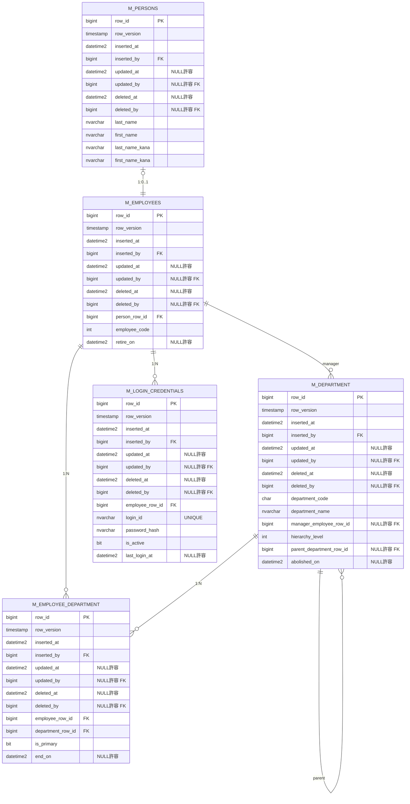

# ER図 - Advance データベース

**バージョン:** 1.0  
**作成日:** 2026-07-19  
**データベース名:** Advance  

---

## 概要

SupportAdvance プロジェクトの基幹データベーススキーマ。人事・組織管理、認証情報、監査トレーサビリティを統合したER図。

---

## ER図



---

## テーブル一覧

| テーブル名 | 説明 | 件数レベル |
|---|---|---|
| **m_persons** | 人名マスタ（従業員 + 非従業員） | ~数千件 |
| **m_employees** | 従業員マスタ（person と 1:0..1） | ~数千件以下 |
| **m_login_credentials** | ログイン認証情報 | m_employees と 1:N |
| **m_department** | 部署マスタ（階層構造） | ~数百件 |
| **m_employee_department** | 従業員所属部門（複数所属対応） | m_employees × m_department の関連 |

---

## 関連図解

### 1. **人 → 従業員 → 部門** の関連

```
m_persons (すべての人：従業員 + 非従業員)
    ↓ 1:0..1 (1対0または1)
m_employees (従業員のみ)
    ↓ 1:N
m_employee_department (従業員所属)
    ↓ N:1
m_department (部署)
```

### 2. **ログイン認証の流れ**

```
Windows ログイン（M + 従業員コード）
    ↓
m_employees.employee_code で検索
    ↓
【見つかる】→ 自動ログイン
【見つからない】→ ログインダイアログ
              ↓
           m_login_credentials で認証
              ↓
           employee_row_id を特定
```

### 3. **部署の階層構造**

```
m_department (self-join)
├── hierarchy_level: 0 (トップ)
│   └── parent_department_row_id: NULL
├── hierarchy_level: 1 (本部)
│   └── parent_department_row_id: (トップのrow_id)
├── hierarchy_level: 2 (部)
│   └── parent_department_row_id: (本部のrow_id)
├── hierarchy_level: 3 (グループ・課)
│   └── parent_department_row_id: (部のrow_id)
└── hierarchy_level: 4 (係・チーム)
    └── parent_department_row_id: (課のrow_id)
```

---

## 監査情報の統一構造

### すべてのテーブルが持つ共通カラム

```sql
row_id              bigint       -- 主キー（シーケンスNo）
row_version         timestamp    -- 楽観的ロック用タイムスタンプ
inserted_at         datetime2    -- 作成日時
inserted_by         bigint       -- 作成者 (FK → m_employees.row_id)
updated_at          datetime2    -- 更新日時（NULL許容、新規時はNULL）
updated_by          bigint       -- 更新者 (FK → m_employees.row_id, NULL許容)
deleted_at          datetime2    -- 削除日時（NULL許容）
deleted_by          bigint       -- 削除者 (FK → m_employees.row_id, NULL許容)
```

**ポイント:**
- `updated_at = NULL` → 新規レコード（未更新）
- `deleted_at IS NOT NULL` → 論理削除済み
- `inserted_by`, `updated_by`, `deleted_by` は **m_employees.row_id** を参照

---

## FK（外部キー）制約一覧

| テーブル | カラム | 参照先 | 説明 |
|---|---|---|---|
| **m_persons** | inserted_by | m_employees.row_id | 作成者 |
| | updated_by | m_employees.row_id | 更新者 |
| | deleted_by | m_employees.row_id | 削除者 |
| **m_employees** | person_row_id | m_persons.row_id | 人名情報 |
| | inserted_by | m_employees.row_id | 作成者 |
| | updated_by | m_employees.row_id | 更新者 |
| | deleted_by | m_employees.row_id | 削除者 |
| **m_login_credentials** | employee_row_id | m_employees.row_id | ログイン対象従業員 |
| | inserted_by | m_employees.row_id | 作成者 |
| | updated_by | m_employees.row_id | 更新者 |
| | deleted_by | m_employees.row_id | 削除者 |
| **m_department** | manager_employee_row_id | m_employees.row_id | 部長（NULL許容） |
| | parent_department_row_id | m_department.row_id | 親部署（自己参照、NULL許容） |
| | inserted_by | m_employees.row_id | 作成者 |
| | updated_by | m_employees.row_id | 更新者 |
| | deleted_by | m_employees.row_id | 削除者 |
| **m_employee_department** | employee_row_id | m_employees.row_id | 従業員 |
| | department_row_id | m_department.row_id | 部署 |
| | inserted_by | m_employees.row_id | 作成者 |
| | updated_by | m_employees.row_id | 更新者 |
| | deleted_by | m_employees.row_id | 削除者 |

---

## 設計ノート

### **row_id（シーケンスNo）**
- 範囲: 2147483648 ～ 9223372036854775807
- C# では `long` 型（int型 を使わない）
- SQL Server: `NEXT VALUE FOR [dbo].[s_row_id_sequence]` で採番

### **updated_at のNULL許容**
- 新規レコード作成時: `updated_at = NULL`
- 更新時: `updated_at = (現在時刻)`
- **活用:** アプリケーション層で「未更新 = 新規データ」と判定

### **deleted_at / deleted_by**
- `deleted_at IS NULL` → 有効なレコード
- `deleted_at IS NOT NULL` → 論理削除済み
- 削除復旧時: `deleted_at = NULL, deleted_by = NULL`

### **m_employees.employee_code**
- 1000 ～ N
- 1000: System 管理者（初期値、手動登録）
- Windows ログイン時の従業員コード抽出に使用

### **m_login_credentials.login_id**
- UNIQUE 制約で重複を防止
- ID/パスワード認証用

### **m_department の hierarchy_level**
- 0: トップ（親部署なし）
- 1: 本部
- 2: 部
- 3: グループ・課
- 4: 係・チーム

### **m_department の abolished_on**
- 部署が公式に廃止された日
- `deleted_at` との使い分け:
  - `abolished_on`: 部署の廃止日（業務上の概念）
  - `deleted_at`: レコードの論理削除日（データ管理上の概念）

### **m_employee_department の is_primary**
- `true`: 主たる所属部門
- `false`: 兼務部門
- 同一従業員の同一時点では `is_primary = true` は1件のみ

---

## 初期データ

### **System 管理者（employee_code = 1000）**
手動で以下のレコードを作成：

```sql
-- 1. m_persons に System 管理者の人名を登録
INSERT INTO m_persons (row_id, last_name, first_name, last_name_kana, first_name_kana, ...)
VALUES (..., 'System', 'Admin', 'システム', 'アドミン', ...);

-- 2. m_employees に System 管理者を登録
INSERT INTO m_employees (row_id, person_row_id, employee_code, ...)
VALUES (..., (上記のrow_id), 1000, ...);

-- 3. m_login_credentials に ログイン情報を登録（パスワード認証用）
INSERT INTO m_login_credentials (row_id, employee_row_id, login_id, password_hash, is_active, ...)
VALUES (..., (上記のrow_id), 'system', (ハッシュ), 1, ...);
```

---

## 次のステップ

1. ✅ ER図完成（本ドキュメント）
2. ⏳ 詳細な CREATE TABLE 文（SQL Server 版）
3. ⏳ トリガーベース監査ログ（PostgreSQL 版）
4. ⏳ インデックス戦略
5. ⏳ マイグレーションスクリプト

---

## 参考資料

- [CLAUDE.md](../../../.claude/CLAUDE.md) - プロジェクト設計ガイドライン
- [Phase1_仕様検討結果.md](../../SharedKernel/ValueObjects/Audit/Phase1_仕様検討結果.md) - CreatedBy/UpdatedBy/DeletedBy 仕様
